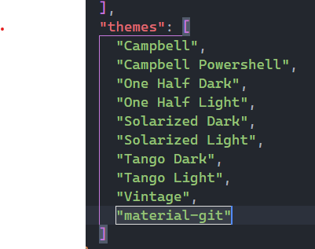
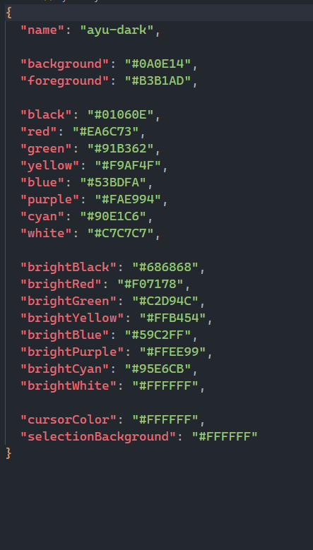

# Nodeterm

_CLI program that allows you to customize the windows terminal._

## Requirements

- [Node.js](https://nodejs.org/en/)
- [npm](https://www.npmjs.com/)
- [windows terminal](https://apps.microsoft.com/store/detail/windows-terminal/9N0DX20HK701?hl=en-us&gl=US)

## Get Started 🚀

_Run this command to install the CLI:_

```
$ npm install -g nodeterm
```

## Setting the enviroment

This command creates a new property to the settings.json file used by windows terminal.

This property is used to know which themes are installed and not to duplicate them.

```
$ nodeterm --init
```



#### If you want reset the themes

Run this command to reset the themes.

```
$ nodeterm --reset
```

#### There themes preinstalled

  - ayu-dark
  - ayu-mirage
  - dracula
  - material-git

You can add more themes to the "themes" folder. The .json file and the theme must have the same name so you can identify it. 
Windows Terminal uses this scheme: 



### Command what you can do

``` 
$ nodeterm -t --theme dracula

$ nodeterm -s --size 20

$nodeterm -o --opacity 90

$nodeterm -f --font 'cascadia-code' // only use font installed
```


